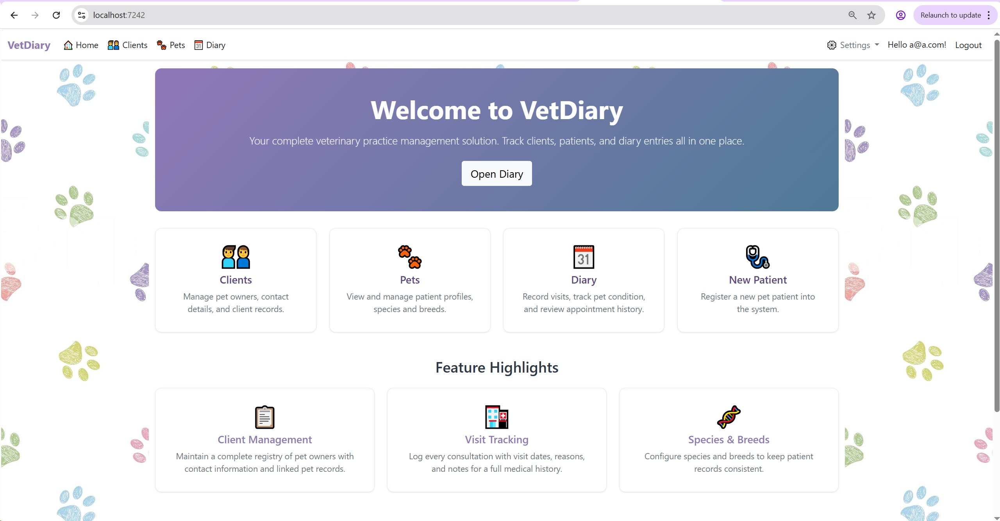
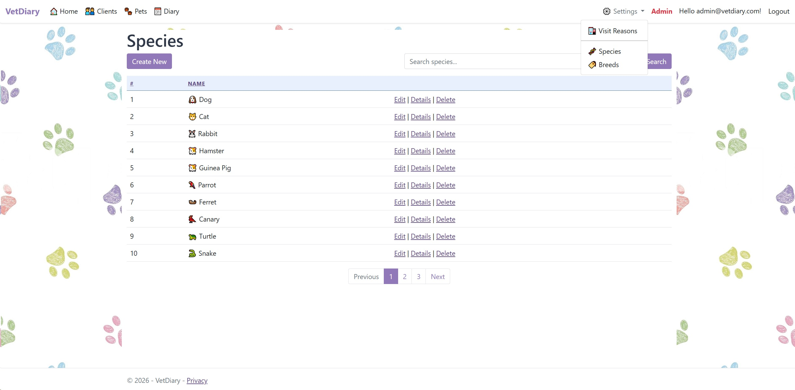
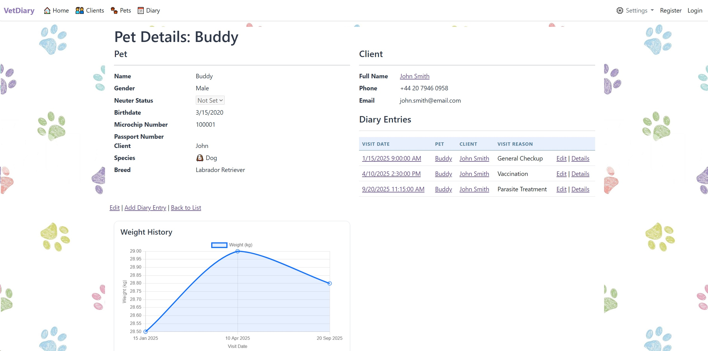
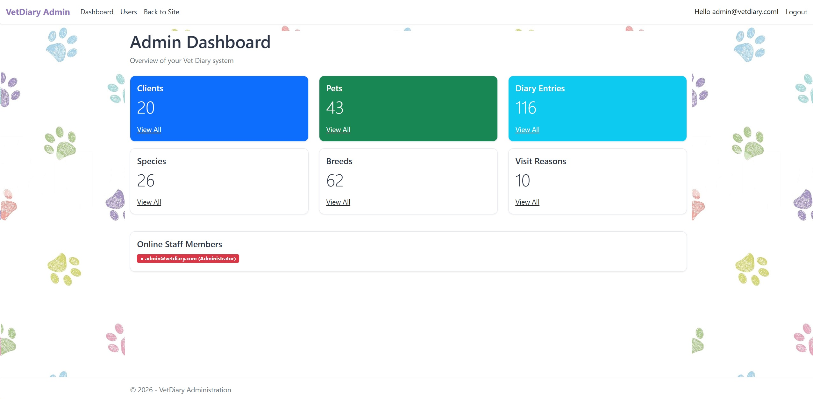

# 🐾 VetDiary

> This project is a veterinary practice management web application which allows tracking clients, patients, and medical diary entries all in one place.

The project is deployed at http://vetdiary.runasp.net/


---

## 📋 Table of Contents

- [About the Project](#about-the-project)
- [Technologies Used](#technologies-used)
- [Architecture](#architecture)
- [Features](#features)
- [Prerequisites](#prerequisites)
- [Database Setup](#database-setup)
- [Getting Started](#getting-started)
- [Usage](#usage)
- [Project Structure](#project-structure)
- [Entity Models](#entity-models)
- [Services Layer](#services-layer)
- [Validation](#validation)
- [Seeding](#seeding)
- [Authentication & Authorization](#authentication--authorization)
- [Real-Time Features](#real-time-features)
- [Unit Tests](#unit-tests)
- [Test Coverage](#test-coverage)
- [Design Decisions](#design-decisions)
- [Deployment](#deployment)
- [License](#license)
- [Contact](#contact)

---

## 📖 About the Project

VetDiary is a web application designed for veterinary clinics to manage their daily operations. It allows veterinarians to maintain client records, track pets with detailed profiles (species, breed, microchip, passport), and create medical diary entries documenting visits, vital signs, and clinical observations.

---

## 🛠️ Technologies Used

| Technology            | Version  | Purpose                                         |
|-----------------------|----------|-------------------------------------------------|
| ASP.NET Core MVC      | 8.0      | Web framework with Razor views                  |
| Entity Framework Core | 8.0      | ORM with Code-First migrations                  |
| MS SQL Server         | -        | Relational database                             |
| ASP.NET Identity      | 8.0      | Authentication, roles, and user management      |
| SignalR               | 8.0      | Real-time dashboard updates and online presence |
| Chart.js              | 4.5.1    | Client-side data visualization (weight charts)  |
| Bootstrap             | 5.1.0    | Responsive frontend styling                     |
| xUnit                 | 2.9      | Unit testing framework                          |
| EF Core InMemory      | 8.0      | In-memory database for tests                    |
| coverlet              | 6.0      | Code coverage collection                        |

---

## Architecture

The project follows a **layered architecture** with clear separation of concerns.

**Key principles:**
- **Dependency Injection** - all services are registered via ASP.NET Core built-in DI container
- **Interface-based design** - services implement interfaces for testability and loose coupling
- **ViewModels** - separate project for presentation-layer DTOs, keeping domain models clean
- **Shared constants** - validation rules centralized in `VetDiary.Shared`
- **Composition over inheritance** - `PaginatedList<T>` uses composition with `IReadOnlyList<T>`

---

## Features

- **Client Management** - full CRUD for pet owners with contact details
- **Pet Profiles** - register pets with species, breed, microchip, passport, and health info
- **Diary Entries** - record medical visits with vital signs (weight, temperature, pulse, body condition score, behaviour)
- **Species & Breeds** - configurable catalog with dynamic breed filtering by species (AJAX)
- **Visit Reasons** - customizable visit categorization (checkup, vaccination, surgery, etc.)
- **Admin Area** - dedicated MVC Area with dashboard statistics, user management, and online presence
- **Real-Time Dashboard** - SignalR-powered live updates for entity counts and online staff tracking
- **Online Presence** - shows which staff members are currently logged in with their roles
- **Weight History Chart** - Chart.js line graph on pet details page showing weight trends over time
- **Role-Based Access** - User and Administrator roles with role-based navigation
- **Pagination** - all index pages support paginated display
- **Sorting** - all index columns are sortable with ascending/descending toggle
- **Search & Filtering** - text search across clients, pets, and diary entries; species and visit reason filters
- **Custom Login & Register** - styled card-based authentication pages
- **Custom Error Pages** - styled 404 and 500 error views
- **Responsive Design** - Bootstrap 5
- **Data Seeding** - 20 clients, 43 pets, 116 diary entries, 22 species, 62 breeds, and 10 visit reasons
- **Input Validation** - client-side and server-side with data annotations
- **CSRF Protection** - global `AutoValidateAntiforgeryToken` filter
- **Partial Views** - reusable pagination component, login partial, validation scripts

---

## Prerequisites

- [.NET SDK 8.0+](https://dotnet.microsoft.com/download)
- [Visual Studio 2022](https://visualstudio.microsoft.com/) or [VS Code](https://code.visualstudio.com/)
- [SQL Server](https://www.microsoft.com/en-us/sql-server)
- [Git](https://git-scm.com/)

---
## Database Setup

The project uses **Entity Framework Core** with a Code-First approach.

Connection string is configured in `appsettings.json`:

```json
"ConnectionStrings": {
  "DefaultConnection": "Server=(localdb)\\mssqllocaldb;Database=YourDbName;Trusted_Connection=True;"
}
```

To create and seed the database:

```bash
dotnet ef database update
```
---

## 🚀 Getting Started

### 1. Clone the repository

```bash
git clone https://github.com/anita-k/VetDiary
cd VetDiary/VetDiary.Web
```

### 2. Restore dependencies

```bash
dotnet restore
```

### 3. Apply database migrations

```bash
dotnet ef database update
```

This creates the database and seeds species, breeds, visit reasons, clients, pets, and diary entries.

### 4. Run the application

```bash
dotnet run
```

The app will be available at `https://localhost:7242` or `http://localhost:5118`.

### 5. Default Admin Account

On first startup, the application seeds an administrator account:

- **Email:** admin@vetdiary.com
- **Password:** Admin1234!

---
## Usage

After launching the app:

```
1. Navigate to /Register to create an account.
2. Log in at /Login.
3. Use the dashboard to manage all entities (Pet, Species, Breed, Client, DiaryEntry, VisitReason).
```






---

## Project Structure

```
VetDiary Solution/
│
├── Data
    ├──VetDiary.Data              # DbContext, entity configurations, migrations
        ├──Configurations         # Fluent API entity configurations + seed data
        ├──Migrations
    ├──VetDiary.Data.Models       # Domain models
├── Services                      # Business logic / service layer
    ├──VetDiary.Services
        ├──Interfaces             # Service contracts
├── Shared                        # Validation constants and enumerations  
├── Web
    ├──VetDiary.ViewModels        #Presentation DTOs        
    ├──VetDiary.Web               #ASP.NET Core MVC web application
        └── Areas/
           ├── Admin/             # Admin area (Dashboard, Users)
           └── Identity/          # Custom login and register pages
        ├── Controllers           # MVC Controllers
        ├── Hubs                  # SignalR hubs (DashboardHub)
        ├── Views                 # Razor Views (.cshtml)
           └──Shared/             # Layout, partials, error pages
        ├── wwwroot/              # Static files (CSS, JS, images)
        ├── appsettings.json      # App configuration
        └── Program.cs            # Entry point, DI, middleware, role seeding

└── VetDiary.Services.Tests/      # xUnit unit tests (77 tests)

```


---

## Entity Models

| Model       | Key Fields                                                                                 | Relationships                     |
|-------------|--------------------------------------------------------------------------------------------|-----------------------------------|
| Client      | FirstName, LastName, Phone, Address, Email                                                 | Has many Pets                     |
| Pet         | Name, Gender, BirthDate, IsNeutered, MicrochipNumber, PassportNumber                       | Belongs to Client, Species, Breed |
| Species     | Name, Icon                                                                                 | Has many Breeds, Pets             |
| Breed       | Name                                                                                       | Belongs to Species, Has many Pets |
| DiaryEntry  | VisitDate, Description, Weight, Temperature, Pulse, Behaviour, BCS (body condition score)  | Belongs to Pet, VisitReason       |
| VisitReason | Name                                                                                       | Has many DiaryEntries             |

---

## Services Layer

Each entity has a dedicated service with interface:

| Service              | Interface             | Responsibilities                                           |
|----------------------|-----------------------|------------------------------------------------------------|
| ClientsService       | IClientsService       | Client CRUD, paginated listing, search, sorting            |
| PetsService          | IPetsService          | Pet CRUD, species filtering, paginated search, sorting     |
| DiaryEntriesService  | IDiaryEntriesService  | Entry CRUD, visit reason filtering, date ordering, sorting |
| SpeciesService       | ISpeciesService       | Species CRUD with pagination and sorting                   |
| BreedsService        | IBreedsService        | Breed CRUD, species-based filtering, pagination, sorting   |
| VisitReasonsService  | IVisitReasonsService  | Visit reason CRUD with pagination and sorting              |

All services are registered as scoped via Dependency Injection in `Program.cs`.

---

## Validation

### Server-Side
- Data annotation attributes on all ViewModels: `[Required]`, `[StringLength]`, `[Range]`, `[Phone]`, `[EmailAddress]`
- Max length constants centralized in `ValidationConstants.cs`
- `ModelState.IsValid` checks in all controller POST actions
- Global `AutoValidateAntiforgeryToken` filter for CSRF protection

### Client-Side
- jQuery Unobtrusive Validation via `_ValidationScriptsPartial.cshtml`
- Bootstrap validation styles for form fields

### Database-Level
- `[Required]` and `[MaxLength]` annotations enforced at database level via EF Core
- Foreign key constraints with `OnDelete.Restrict` to prevent orphaned records

---

## Seeding

The database is seeded via EF Core migrations and application startup:

**Via Migrations (HasData):**
- 22 Species of animals
- 62 Breeds across all species
- 10 Visit Reasons (General Checkup, Illness, Vaccination, Surgery, Dental, Follow-up, Emergency, Grooming, Deworming, Microchipping)
- 20 Clients with realistic names, contact details, and addresses
- 43 Pets distributed across clients (mix of dogs, cats, rabbits, hamsters, parrot, turtle)
- 116 Diary Entries with visit dates, weights, temperatures, and descriptions

**Via Application Startup (`Program.cs`):**
- Identity Roles: "Administrator", "User"
- Default admin account: admin@vetdiary.com / Admin1234!
- New user registrations are automatically assigned the "User" role

---

## Authentication & Authorization

- **ASP.NET Identity** for user registration and login
- **Two roles:** Administrator and User
- **Automatic role assignment** - new registrations receive the "User" role
- **Role seeding** on application startup
- **Password policy:** minimum 8 characters, requires uppercase, lowercase, digit, and special character
- **BaseController** with `[Authorize]` - all actions require login by default
- **`[AllowAnonymous]`** on Index/Details actions for public viewing
- **Admin Area** protected by `[Authorize(Roles = "Administrator")]`
- **Admin navigation link** visible only to admin users in the main layout
- **Custom login and register pages**

---

## Real-Time Features

The application uses **ASP.NET Core SignalR** for real-time communication:

### Dashboard Updates
- Entity counts (clients, pets, diary entries, species, breeds, visit reasons) refresh automatically when data changes
- Create, Edit, and Delete operations in all controllers trigger a `RefreshDashboard` event

### Online Staff Presence
- Tracks which staff members are currently logged in across the entire application
- Displays online users on the admin dashboard with color-coded role badges (red for Administrator, green for User)
- Uses `ConcurrentDictionary` for thread-safe connection tracking
- SignalR connection is initialized in both main and admin layouts for authenticated users

---

## Unit Tests

The project includes **77 unit tests** covering all 6 service implementations:

| Test Class                  | Tests | Coverage Areas                                           |
|-----------------------------|-------|----------------------------------------------------------|
| ClientsServiceTests         | 13    | CRUD, pagination, search, sorting, not-found handling    |
| PetsServiceTests            | 11    | CRUD, pagination, search, species filter, dropdown data  |
| DiaryEntriesServiceTests    | 14    | CRUD, pagination, search, visit reason filter, sorting   |
| SpeciesServiceTests         | 12    | CRUD, pagination, search, not-found handling             |
| BreedsServiceTests          | 13    | CRUD, pagination, search, species filter, dropdown data  |
| VisitReasonsServiceTests    | 10    | CRUD, pagination, search, not-found handling             |

**Test infrastructure:**
- xUnit test framework
- EF Core InMemory provider for isolated database per test


Run tests:
```bash
dotnet test
```

Run tests with coverage:
```bash
dotnet test --collect:"XPlat Code Coverage"
```

---

## Test Coverage

Test coverage measured with coverlet, **excluding VetDiary.Data** (migrations and configurations):

| Project              | Line Coverage |
|----------------------|---------------|
| VetDiary.Services    | 92.1%         |
| VetDiary.Data.Models | 97.9%         |
| VetDiary.ViewModels  | 90.3%         |
| VetDiary.Shared      | 100%          |
| **Overall**          | **92.0%**     |

> VetDiary.Data is excluded from coverage calculations as it contains EF Core migrations and seed data configurations that are not unit-testable.

---

## Design Decisions

1. **Layered Architecture** - separating Data, Services, ViewModels, and Web projects ensures single responsibility and enables independent testing
2. **Composition-based PaginatedList** - wraps `IReadOnlyList<T>` instead of inheriting from `List<T>`, following SOLID principles
3. **ViewModels per action** - Index, Details, Create, Edit, and Delete ViewModels
4. **Admin Area** - MVC Areas cleanly separate admin functionality with its own layout and navigation
5. **SignalR for real-time updates** - avoids polling and delivers instant feedback when data changes
6. **InMemory testing** - fast, isolated tests without external database dependency
7. **Global AntiForgery** - prevents CSRF attacks application-wide
8. **Centralized validation constants** - shared between models and ViewModels
9. **Seed data via HasData** - reproducible demo data through EF Core migrations

---
## Deployment
 The project is deployed at http://vetdiary.runasp.net/

---

## Contributing

Contributions are welcome! To contribute:

1. Fork the repository
2. Create a new branch: `git checkout -b feature/your-feature-name`
3. Commit your changes: `git commit -m "Add some feature"`
4. Push to the branch: `git push origin feature/your-feature-name`
5. Open a Pull Request

---

## 📄 License

This project is licensed under the **MIT License**. See the [LICENSE](LICENSE) file for details.

---
## 📬 Contact

**Anita K.** – [@anita-k](https://github.com/anita-k)

Project Link: [https://github.com/anita-k/VetDiary](https://github.com/anita-k/VetDiary)

---

*Built as part of the **ASP.NET Advanced** course.*
